<p align="center">
    <a href="https://legacy-roleplay.com" target="blank">
        
    </a>
</p>

<h1 align="center">
    legacy-rp-admin-v3
</h1>

<p align="center">
    <a href="https://travis-ci.com/ExpDev07/legacy-rp-admin-v3" target="blank">
        
    </a
    <a href="https://github.com/ExpDev07/legacy-rp-admin-v3/blob/master/LICENSE.md" target="blank">
        
    </a>
    <a href="https://github.com/ExpDev07/legacy-rp-admin-v3/pulls" target="blank">
        
    </a>
    <a href="https://github.com/ExpDev07/legacy-rp-admin-v3/issues" target="blank">
        
    </a>
</p>

<hr>

<p>
<a href='https://ko-fi.com/C1C510DUQ' target='_blank'>

</a>
    
<a href='https://ko-fi.com/I2I46B8EK' target='_blank'>

</a>
</p>

<strong>100% FREE + OPEN SOURCE.</strong>

> A web interface to help with administrative duties at the FiveM server: Legacy Roleplay. Written in PHP using [Laravel Framework](https://laravel.com/) and
> [Tailwindcss](https://tailwindcss.com) for the frontend.

See [#contributing](#Contributing) for more details on how you can help shape **legacy-rp-admin-v3**. We're always down to improve and receive feedback.

**Urgent? Write to Twoot on Discord: Twootinger#2222.**

## Note

It is recommended that you use Chrome or Edge as your web browser for the best experience.

## Features
* See and search server logs.
* See and search players.
* Warn and ban players, also temporarily.
* See and edit characters.
* [*... open issue to request a feature.*](https://github.com/ExpDev07/legacy-rp-admin-v3/issues/new/choose)

## Improvements from v1
1. Re-done to give a more minimalistic and "simple" look.
2. Backend improvements that encourage scaling and maintainability. 
3. More.

## License
Please refer to [LICENSE.md](https://github.com/ExpDev07/legacy-rp-admin-v3/blob/master/LICENSE.md) for this project's license.

## Contributors
This list only contains some of the most notable contributors. For the full list, refer to [GitHub's contributors graph](https://github.com/ExpDev07/legacy-rp-admin-v3/graphs/contributors).
* [ExpDev07](https://github.com/ExpDev07) (Marius) - creator and maintainer of both frontend and backend.
* [twooot](https://github.com/twooot) (Twoot) - maintainer of both frontend and backend.

## Pictures
(more will be posted soon once some design decisions are finalized).

### Logging in
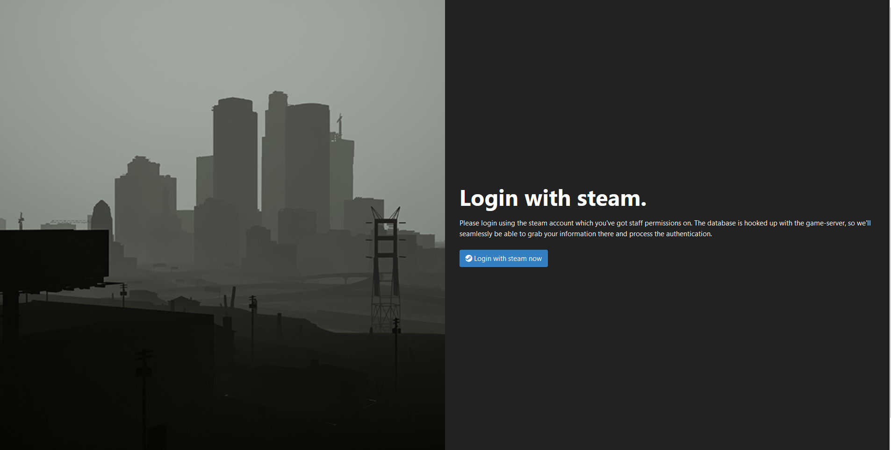

### Dashboard
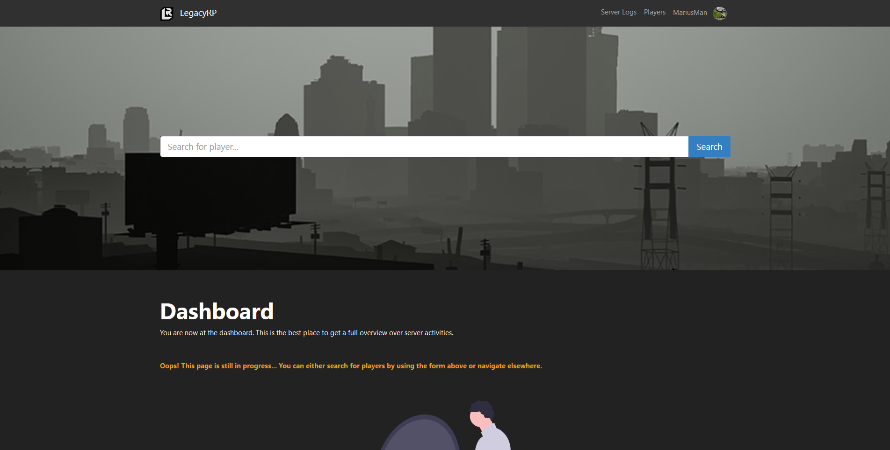

### Players
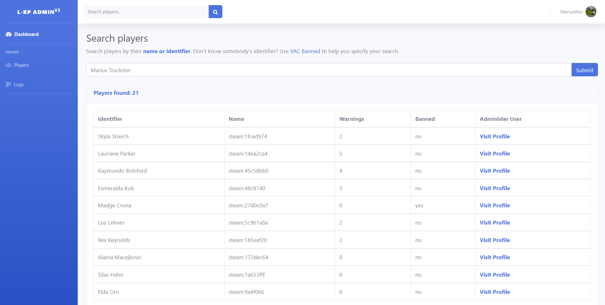

### Viewing player
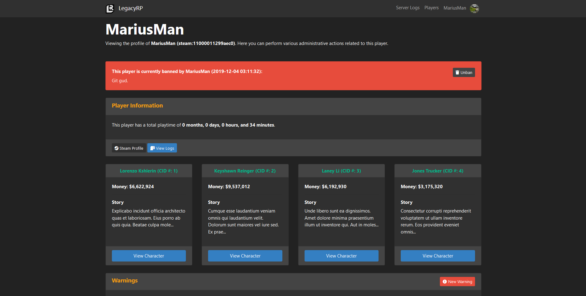

### Characters
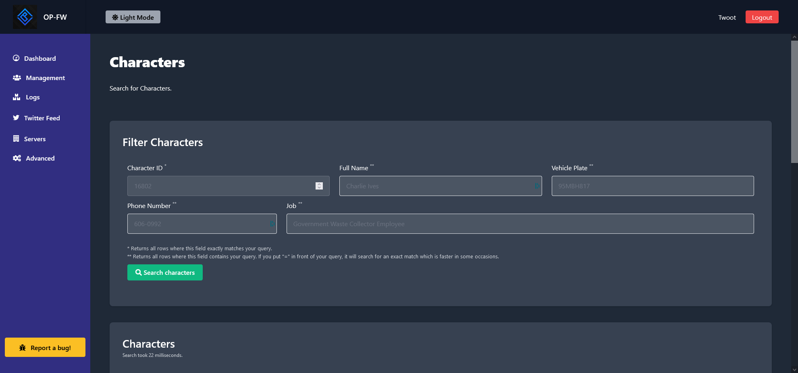

### Viewing character
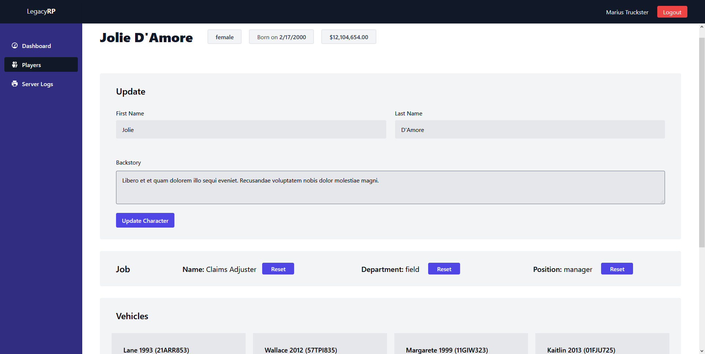

### Server Logs
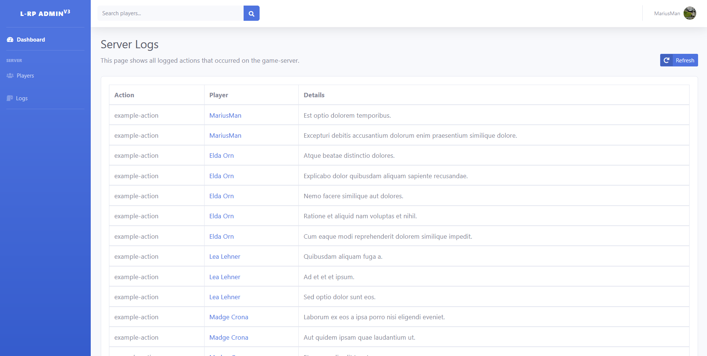

### Panel Logs
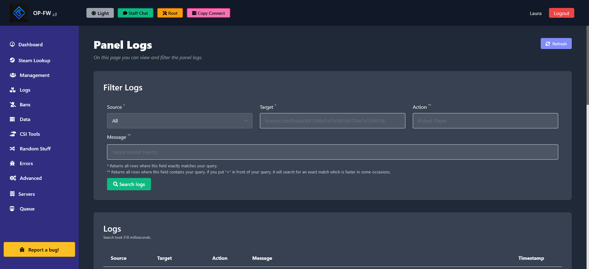

### Server List
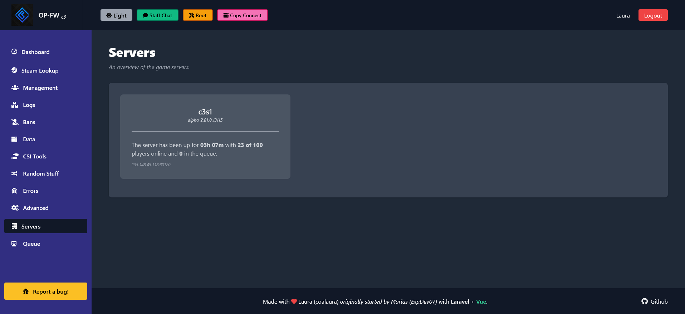

### Advanced
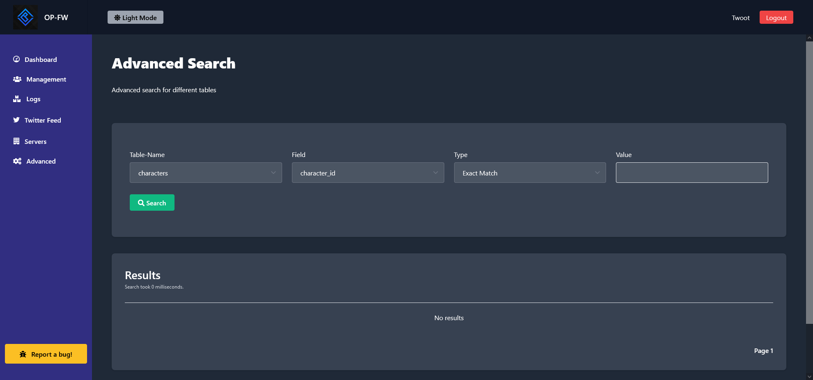

### Suspicious Search
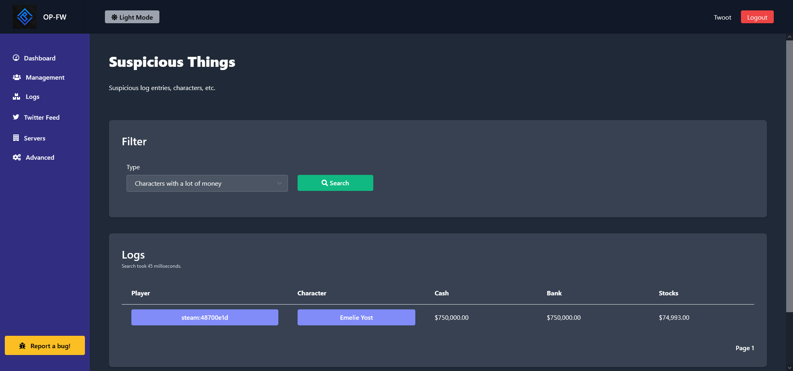

## Contributing
This section describes how you can help contribute.

### Prerequisites
* PHP 7.4+.
* Composer.
* Node (and npm).
* SQL (database).

### Setting up project
Grab yourself a copy of this repository:
```bash
$ git clone https://github.com/ExpDev07/legacy-rp-admin-v3.git
```

Install all the required dependencies (we use both npm and composer):
```bash
$ composer install
$ npm install
```

Create a new file called ``envs/.env`` and copy the contents from ``.env.example`` over to it, then apply your configurations.
```bash
$ cp .env.example envs/.env
```

Create a private and unique application key:
```bash
$ php artisan key:generate
```

Run database migrations so that we can store things:
```bash
$ php artisan migrate
```

Create a symbolic link at **public/storage** so that it points to **storage/app/public**:
```bash
$ php artisan storage:link
```

Install, configure and run the socket server from [legacyrp-admin-panel-sockets](https://github.com/milan60/legacyrp-admin-panel-sockets)

Compile frontend assets (use "dev" for development and "prod" for production):
```bash
$ npm run dev/prod
```

Finally, boot the server up:
```bash
$ php artisan serve
```
